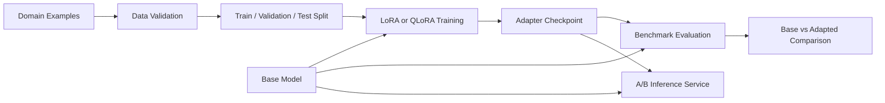

# 🧠 LoRA Domain Fine-Tuning Pipeline

### Reproducible Data Preparation, QLoRA Training, Evaluation, and Adapter Serving

**An end-to-end pipeline for adapting language models to domain-specific behaviour using LoRA and QLoRA.**

---

## Overview

The LoRA Domain Fine-Tuning Pipeline covers the complete adaptation lifecycle:

- synthetic domain dataset generation;
- schema and quality validation;
- deterministic train, validation, and test splitting;
- configurable LoRA or QLoRA training;
- adapter-only checkpoint storage;
- benchmark evaluation;
- base-versus-adapted comparison;
- A/B inference through a common serving interface.

The project separates dataset quality, training configuration, evaluation, and serving so each stage remains reproducible and independently testable.

## Architecture

## Core Capabilities

| Capability | Description |
|---|---|
| Dataset generation | Produces structured domain instruction-response examples |
| Data validation | Detects malformed, duplicated, empty, or low-quality samples |
| Deterministic splitting | Creates reproducible train, validation, and test partitions |
| Configurable LoRA | Controls rank, alpha, dropout, and target modules |
| QLoRA support | Enables four-bit base-model loading for reduced memory usage |
| Adapter-only saving | Stores compact PEFT checkpoints instead of full model weights |
| Benchmark separation | Keeps evaluation examples outside the training set |
| Base-model comparison | Measures behaviour before and after adaptation |
| Dry-run validation | Checks configuration and data without starting GPU training |
| A/B serving | Exposes base and adapted models through one interface |
| Training metadata | Preserves configuration and evaluation artefacts |

## Fine-Tuning Flow

| Stage | Output |
|---|---|
| Data preparation | Clean instruction-response dataset |
| Validation | Quality report and accepted examples |
| Splitting | Reproducible train, validation, and test files |
| Quantised loading | Memory-efficient base model |
| Adapter training | LoRA checkpoint |
| Evaluation | Per-example and aggregate metrics |
| Comparison | Base-versus-adapted performance report |
| Serving | Unified inference API |

## Engineering Highlights

- Transformers model loading
- PEFT LoRA adapters
- Four-bit QLoRA configuration
- TRL supervised fine-tuning
- Configurable training YAML
- Deterministic dataset processing
- Separate benchmark dataset
- Adapter-only persistence
- Dry-run training validation
- Base and tuned model comparison
- FastAPI inference service
- Automated data-quality tests

## Technology Stack

| Layer | Technology |
|---|---|
| Training | PyTorch and Transformers |
| Parameter-efficient tuning | PEFT |
| Trainer | TRL |
| Quantisation | BitsAndBytes |
| Data | Datasets and JSON |
| Validation | Pydantic |
| Serving | FastAPI |
| Configuration | YAML |
| Testing | Pytest |

## Design Principles

1. Training data quality should be verified before GPU resources are used.
2. Evaluation data must remain separate from training examples.
3. Fine-tuning configuration should be reproducible and version-controlled.
4. Adapter checkpoints should remain portable and compact.
5. Base and adapted behaviour should be compared through the same interface.

## Security

- Training data must not contain unapproved personal or confidential information.
- Model and dataset licences should be reviewed before use.
- Checkpoints and datasets may reveal domain information and require access control.
- Provider and model-hub credentials remain outside source control.
- Production evaluation should include safety and privacy-specific test cases.

## License

This project is licensed under the [MIT License](LICENSE).

**LoRA Domain Fine-Tuning — reproducible model adaptation without full-parameter training.**

