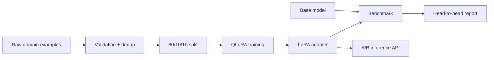

<div align="center">

# LoRA Domain Fine-Tuning Pipeline

### Dataset curation, QLoRA configuration, evaluation, and A/B serving

[](https://www.python.org/)
[](https://fastapi.tiangolo.com/)
[](https://www.docker.com/)
[](LICENSE)

</div>

---

## Overview

Provides a reproducible domain-adaptation repository with 600 synthetic instruction examples, deterministic train/validation/test splits, a configurable PEFT/TRL QLoRA script, benchmark tooling, and an API that compares baseline and adapted behaviour.

## Core capabilities

| Capability | Implementation |
|---|---|
| Dataset pipeline | Validation, deterministic splits, 600 examples, and a separate benchmark. |
| LoRA configuration | Rank, alpha, dropout, target modules, epochs, and learning rate in YAML. |
| Memory-efficient training | Optional 4-bit QLoRA through bitsandbytes. |
| Reproducibility | Single config file and dry-run validation. |
| Evaluation | Head-to-head benchmark and regression examples. |
| Serving | FastAPI and Streamlit A/B comparison. |

## Architecture



## Quick start on Windows

```powershell
py -3.11 -m venv .venv
.\.venv\Scripts\Activate.ps1
python -m pip install --upgrade pip
pip install -e ".[dev,dashboard]"
Copy-Item .env.example .env
pytest -q
lora-pipeline validate
lora-pipeline train --dry-run
lora-pipeline serve
```

API documentation: `http://localhost:8610/docs`

## Docker

```powershell
Copy-Item .env.example .env
docker compose up --build
```

## Safety and data handling

- The default mode is offline and uses synthetic sample data.
- Put provider keys only in `.env` or GitHub repository secrets.
- Do not commit training checkpoints, production logs, private documents, or user data.
- Run `pytest -q` before every push.

### Actual GPU training

Install the optional stack with `pip install -e ".[training]"`, then run `lora-pipeline train`. The included default is a small model for accessibility; change `base_model` in `config/train.yaml` for a larger Llama or Mistral checkpoint. Training requires a compatible GPU and downloads model weights.

## License

[MIT](LICENSE)
